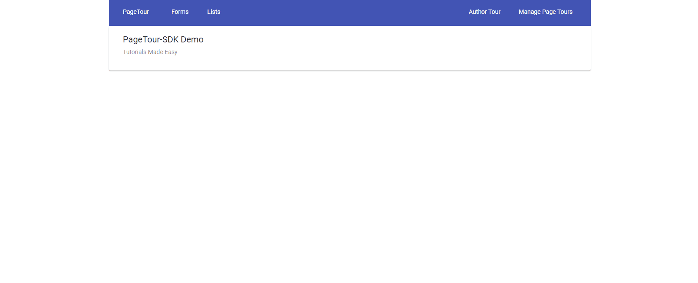

 # PageTour SDK

  

  

## Overview

  

User readiness, digital app adoption, and app feature visibility in enterprise and consumer products is efficacious when driven interactively, and within the context of the application. However, the cost and delay in engineering such assets significantly impacts fast adoption, smooth engagement, and overall user satisfaction for your application. PageTour SDK addresses this ubiquitous challenge through interactive page tours. 
 
PageTour is a lightweight, Typescript SDK distributed as an NPM package. The SDK can be consumed in Angular, React, Typescript, and Plain JavaScript web apps. It provides an intuitive UI to web developers and application admins to author guided tours for web apps. Tours can be shared with end users through generated URLs, and also be targeted to a defined set of users.
 
PageTour SDK is easy to use and provides a number of options to customize your product for feature readiness and landing efforts.

## Installation

  
  

### PageTour SDK

  

    npm install pagetour-sdk

  

### Repository package

PageTour SDK requires a repository object for initialization. One can either use one of the two available repository packages, or write a new custom repository class by implementing IPageTourRepository interface. (Insert link)

  

Install the repository package as per the requirement:

**1. Install the HttpRepository package**: This package is meant for development and production use. For production use, a custom API needs to be implemented for storing and retrieving PageTours. HttpRepository makes network calls to the provided API.

  

    npm install pagetour-sdk.http

**2. Install the LocalStorageRepository package**: This package is meant for quickly checking out PageTour in your application and doing a POC.

  

    npm install pagetour-sdk.localrepository

  

> Note: This package only persists the data in browser local storage. It is meant for only trying out the SDK and should not be used otherwise.

  
  
  

## Usage

### Import the library

  

    import { PageTour } from 'pagetour-sdk';
    ...
    const options = {};

### Import and initialize the available repository or implement the IPageTourRepository

**1. LocalStorageRepository**

  

    import { LocalStorageRepository } from 'pagetour-sdk.localrepository';
    ...
    this.repository = new LocalStorageRespository();

**2. HttpRepository**

  

    import { HttpRepository } from 'pagetour-sdk.http';
    
    ...
    /**
    HttpRepository takes a configuration object containing
    baseUrl of the API to be called for storing and retrieving tours.
    Additionlly getEndpoint, putEndpoint, postEndpoint and deleteEnedpoints
    can be provided.
    */
    import { HttpRepository } from 'pagetour-sdk.http';
    ...
    this.repository = new HttpRepository({baseUrl:'https://api-baseUrl.com/'});

**3. Implement the interface**: Refer the docs for implementing the interface.

  

### Initialize PageTour and get the instance

  

    Pagetour.init(this.repository, options);
    this.pagetour = PageTour.GetInstance();

### Install and import bootstrap

Pagetour uses bootstrap. [Install](https://www.npmjs.com/package/bootstrap) it if not already installed. Import it in the global stylesheet.

  

    @import '~bootstrap/dist/css/bootstrap.css';

  

### Import css in the global stylesheet

  

    @import '~pagetour-sdk/dist/css/pagetour.css';

  

### Open PageTour manager on button click

Add a button in the UI to open the PageTour manager.

    const OpenManagerButton = document.getElementById('manage-tours');
    OpenManagerButton.onClick = Pagetour.GetInstance().openPageTourManageDialog();

  

## Sample App

Location:

1. Clone the repo

2. got to PageTour-SDK/sample run `npm install` and then `npm run start`

3. Browse to http://localhost:4200

## Documentation

[See GitHub Wiki.](https://github.com/microsoft/PageTour-SDK/wiki)

 ## Development Environment Setup
 The repository is a Lerna Monorepo. Learn more about  Lerna [here](https://github.com/lerna/lerna).
 1. Instal Node Version >=10.16.0
 2. Clone the repository and run `npm install` inside the root directory
 3. Run `npm run build` in the root to concurrently build all the packages inside the 'apps' folder.

